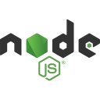

 

---

<h1 align="center">Hi 👋, I'm Harshit Soni</h1>
<h3 align="center">Pre-final Year student at MBM University, Jodhpur having proficiency in, Artificial Intelligence ||
    Machine learning || Data Science || Web Developer || DSA || Robotics || Leadership</h3>

 

---

<h3 align="left">Connect with me:</h3>

    
    
    
    
    

 Checkout my linktree to connect with me [https://linktr.ee/harshit_soni78](https://linktr.ee/harshit_soni78)

---

<h3 align="left">Languages and Tools:</h3>

|                                                                                                                                                                           |                                                                                                                                                                       |                                                                                                                                                                       |                                                                                                                                                                                       |                                                                                                                                                                  |                                                                                                                                                                                  |
| ------------------------------------------------------------------------------------------------------------------------------------------------------------------------- | --------------------------------------------------------------------------------------------------------------------------------------------------------------------- | --------------------------------------------------------------------------------------------------------------------------------------------------------------------- | ------------------------------------------------------------------------------------------------------------------------------------------------------------------------------------- | ---------------------------------------------------------------------------------------------------------------------------------------------------------------- | -------------------------------------------------------------------------------------------------------------------------------------------------------------------------------- |
|                        |  |                   |                                |                |                           |
|         |                          |              |                                                |                  |  |
|                              |               |  |  |   |                     |
|                          |           |                 |                               |              |                     |
|  |       |             |                          |  |                                   |

---

|                                                                                                                                                                                                                                                                |                                                                                                                                                                                            |
| -------------------------------------------------------------------------------------------------------------------------------------------------------------------------------------------------------------------------------------------------------------- | ------------------------------------------------------------------------------------------------------------------------------------------------------------------------------------------ |
| 
  
 | 

 |
| 
&nbsp;
                                                                                      | 

                                               |
